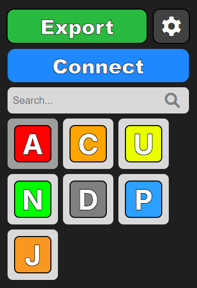

A drag-and-drop system for creating github workflows! Definitely my biggest project yet!

---

I made this because making workflows was always a tedious task for me to do efficiently and accurately, but with Overflow, the task of making github workflows is easier than ever with our visual-based system.

This was made for [hackclub arcade](https://hackclub.com/arcade) and is hosted through their free vps!

> [!WARNING]\
> Overflow is a work in progress and is made by a singular person (me), don't expect extremely frequent updates, and a todo list can be found [here](./development/TODO.md)

## Contributions
Contributions are accepted! If you find any issues, put them in the issues tab or open a pull request!