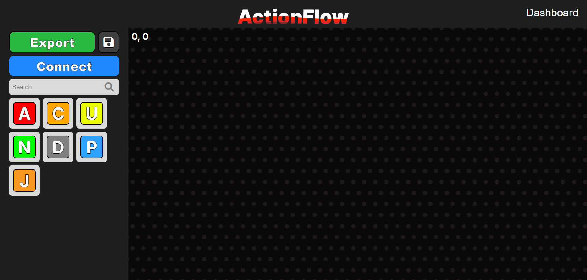
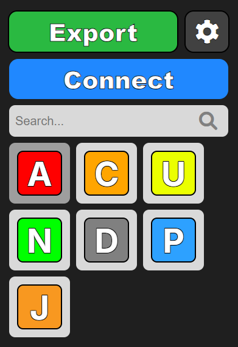

# The workflow builder
This document will explain both using it and contributing to it

# Usage
The workflow builder may seem complicated, but it's actually quite simple to use. All you need is an account and a project, which you can create by clicking the `+` on the dashboard

Once you have your project, you should be on the following screen.

Now there are many parts of this interface, and all of them have a purpose

The sidebar has the main purpose of giving you a list of components and utilies, currently there are 7 components and 3 buttons to press on the sidebar.
- The button labeled `Export` is used to generate the code for the workflow
- The save button is to save your project (Don't forget to save your project before leaving your computer!)
- The connect button is used to connect components to eachother, you connect step components to action components for the export

1. The codebase is quite unoptimized, to add components, you must do the following
    - Add the component table in `ComponentManager.jsx`
    - Add the styling to `ComponentStyles.css`
    - Add the funcitonality in `Export.jsx`